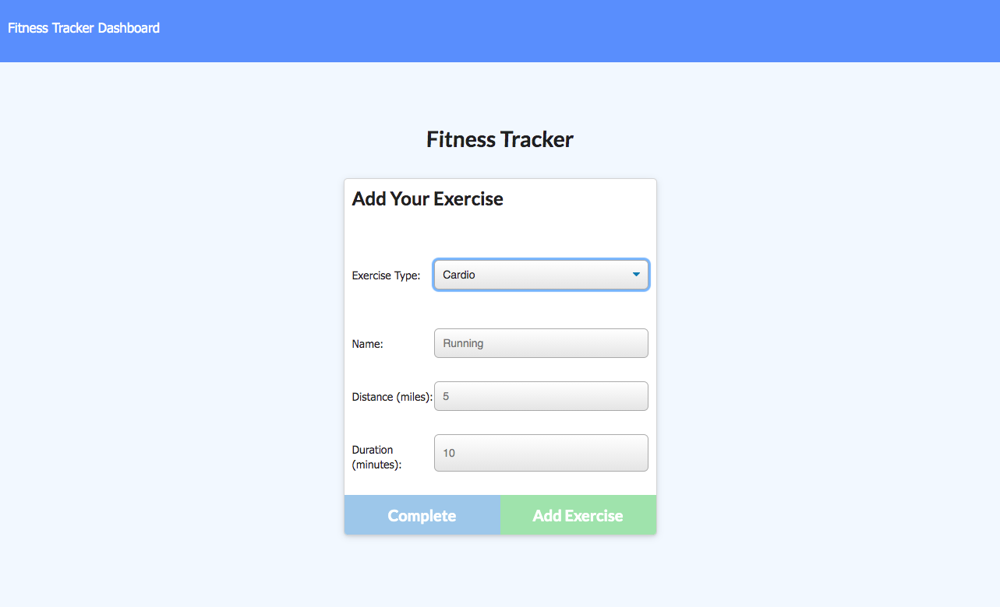

# Workout Tracker

## Description

This is a fitness application that allows a user to view, create, and track their daily workouts. A user can start a new workout, log several different exercises, and even continue a workout that has not yet been completed. This application features the use of [Express.js](https://expressjs.com/) for the back-end, [Node.js](https://nodejs.org/en/docs/) to bring the front and back ends together, [MongoDB](https://docs.mongodb.com/guides/) for the database, and the npm package [Morgan](https://www.npmjs.com/package/morgan) for middleware.

Deployed Project: https://boiling-thicket-15106.herokuapp.com/

## Table of Contents

- [Description](#description)
- [License](#license)
- [Installation](#installation)
- [Usage](#usage)
- [Contributors](#contributors)
- [Tests](#tests)
- [Questions](#questions)
- [Screenshots](#screenshots)

## License

License chosen: MIT.
More information about the license chosen can be found on [Open Source Initiative](https://opensource.org/licenses/MIT).

## Installation

To install this application, the user first needs to clone the repository to their local machine. From there, the user then needs to navigate to the project directory in either Terminal or Git Bash, depending on the users OS. Alternatively, the user can also use the integrated terminal within VS Code. Next, the user needs to install the npm packages by running `npm i`. Once the following steps are completed the user needs to seed the databse by running `npm run seed`. Lastly, the user can start the application by running `npm run start` or `node server.js`.

## Usage

The usage of this project is to allow a user to quickly and easily view, create, and track daily workouts. The user should be able to log multiple exercises in a workout on a given day as well as be able to track the name, type, weight, sets, reps, and duration of exercises.

## Contributors

[eroux13](https://www.github.com/eroux13)

## Tests

There are currently no tests for this project.

## Questions

Feel free to follow my GitHub [profile](https://www.github.com/eroux13).
If you have any questions about this project, please reach out to me via ej.roux13@gmail.com.

## Screenshots

Homepage for when a user first visits the application.

Depending on what type of exercise the user selects (resistance or cardio) will render the corresponding page.

Dashboard to see the fitness progress for the user.

